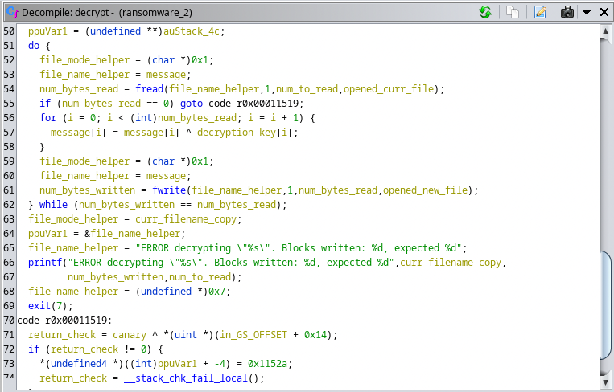

# Week 7 - Reverse Engineering Ransomware


This week we reverse engineered some ransomware to find and decrypt the given files by understanding and rewriting the decrypt function in the ransomware.


---

# Ransomware 1:


```
filename = input("Please input the file to decode: ")
newfilename = filename[:-7]
with open(filename, "rb") as file:
    with open(newfilename, "w") as newfile:
        while byte := file.read(1):
            newbyte = int.from_bytes(byte) ^ 0x34
            newfile.write(chr(newbyte))

```

Decryption function explaination:


The decryption function reads in the file byte by byte and xors it with the key shown in the reverse engineered code. These new bytes are written to the original filename by removing the 7 character extension added by the ransomware.


Decrypted file:


Dear Student,

You have decrypted the message. Good job!

"Many of the engineers I interviewed worked on reverse-engineering technology
. Itâs a hallmark of Area 51."
 ~ ANNIE JACOBSEN

Go NMSU RE!


Screenshots:


---

# Ransomware 2:


```
filename = input("Please input the file to decode: ")
newfilename = filename[:-7]
decryption_code = "1337"
ptr = 0
with open(filename, "rb") as file:
    with open(newfilename, "w") as newfile:
        while byte := file.read(1):
            newbyte = int.from_bytes(byte) ^ ord(decryption_code[ptr])
            newfile.write(chr(newbyte))
            ptr += 1
            if ptr == 4:
                ptr = 0

```

Decryption function explaination:


The decryption function reads in the file byte by byte and then applies the decryption key as found in the reverse engineered function. Since the decryption key is 4 bytes long a pointer is used to keep track of which character to use. This pointer loops around when the bounds are exceeded. These new bytes are written to the original filename by removing the 7 character extension added by the ransomware. 


Decrypted file:


Dear Student,

You have decrypted the message. Good job!

"Basically, if reverse engineering is banned, then a lot of the open source c
ommunity is doomed to fail."
 ~ Jon Lech Johansen

Go NMSU RE!


Screenshots:





---

# Ransomware 3:


```
filename = input("Please input the file to decode: ")
newfilename = filename[:-7]
decryption_code = "R3V3R53"
ptr = 0
with open(filename, "rb") as file:
    with open(newfilename, "w") as newfile:
        while byte := file.read(1):
            newbyte = int.from_bytes(byte) ^ ord(decryption_code[ptr])
            newfile.write(chr(newbyte))
            ptr += 1
            if ptr == 7:
                ptr = 0
```

Decryption function explaination:

The decryption function reads in the file byte by byte and then applies the decryption key as found in the reverse engineered function. Since the decryption key is 7 bytes long a pointer is used to keep track of which character to use. This pointer loops around when the bounds are exceeded. These new bytes are written to the original filename by removing the 7 character extension added by the ransomware.

Decrypted file:


Dear Student,

You have decrypted the message. Good job!

"A good engineer thinks in reverse and asks himself about the stylistic conse
quences of the components and systems he proposes."
 ~ Helmut Jahn

Go NMSU RE!


Screenshots:


