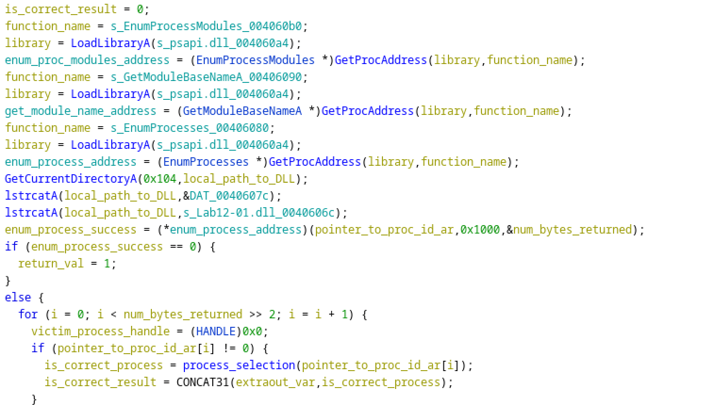
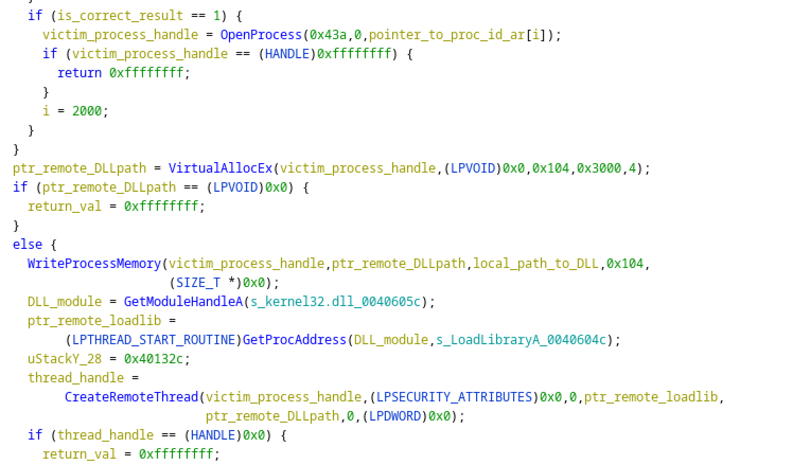
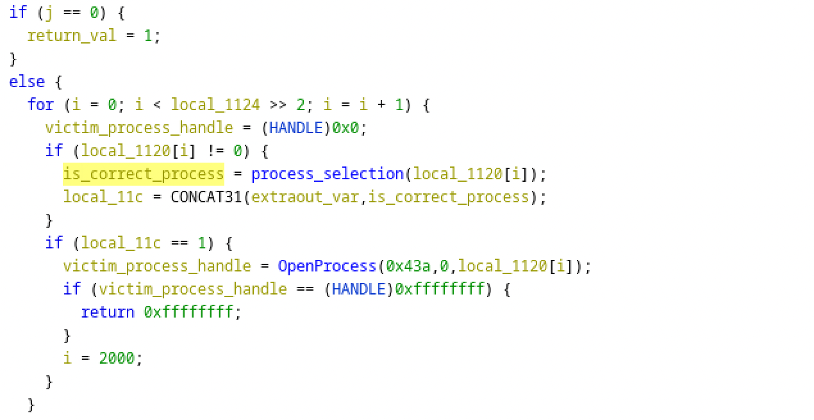
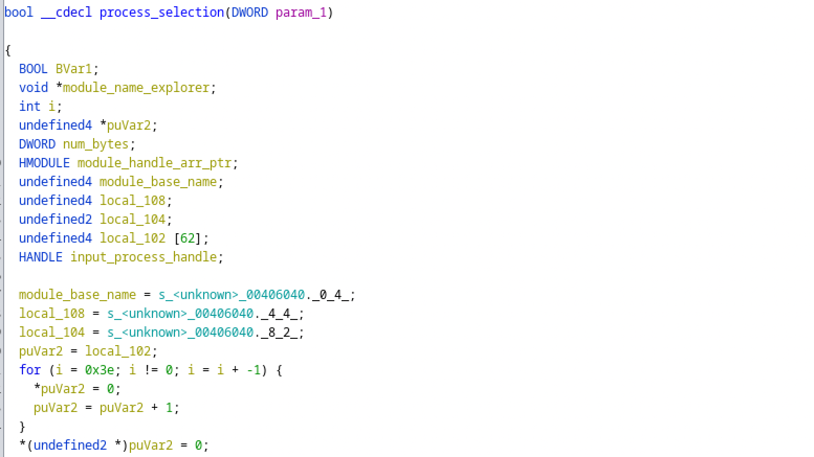
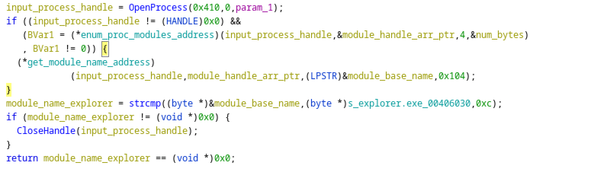
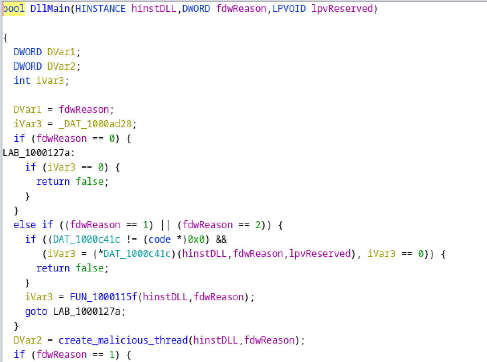
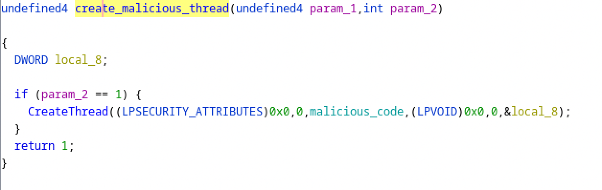
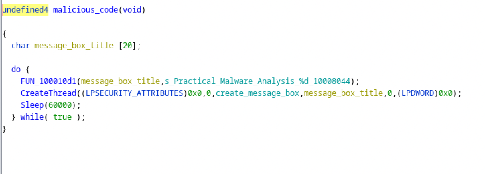
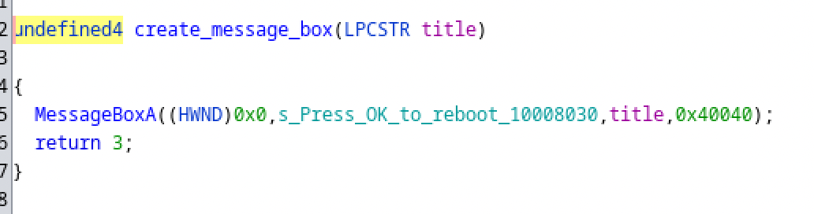

# Week 8 - DLL Injection

This week we learned about how DLL Injection works and reverse engineered an example exe and dll executing DLL Injection.

---

## Questions

1) Prove that the loader is using DLL injection. (Don't forget a relevant snapshot in Ghidra.)

We can see in the following screenshots this code follows the DLL injection steps we discussed in class:

2) Identify the process that will be injected into. Seeing a string in Ghidra isn't sufficient -- explain how the process gets selected.

The process that will be injected into is `explorer.exe`. It is found by looping through processes and checking for which one has a module named `explorer.exe`.

3) Identify the entry point of the DLL injection. Where is DllMain?

DllMain is the function that appears as `entry` in ghidra. This is obvious because it creates the malicious thread and isn't called by any other function. It also has the correct number of inputs and appears to do the expected functions.

4) This malware does something every ______ seconds. How often, and where is the loop where that waiting happens?

The malware creates a thread to do something every 60 seconds. The loop that does this is in a function that is called by a thread created by DllMain.

5) What does the malware do every _______ seconds?

The malware creates a thread which creates a message box every 60 seconds. The message box has a title "Practical Malware Analysis %d" and a message "Press OK to reboot"

